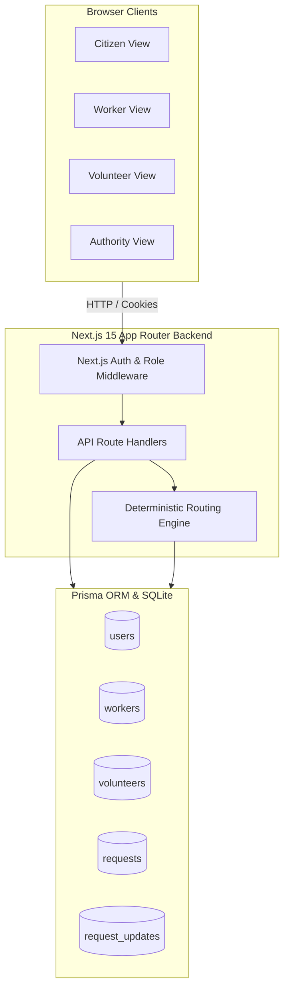
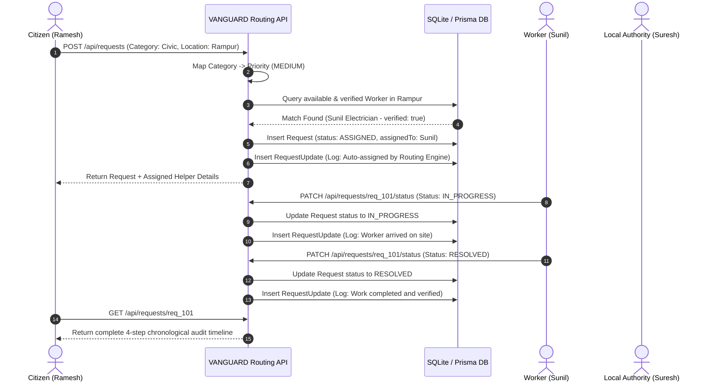

# VANGUARD — Rural Service Routing Platform
## Official System Architecture & Technical Documentation

---

## 📑 Table of Contents
1. [Executive Summary](#1-executive-summary)
2. [Why It Is Made (The Problem Statement)](#2-why-it-is-made-the-problem-statement)
3. [For What It Is Made (Core Mission & Use Cases)](#3-for-what-it-is-made-core-mission--use-cases)
4. [Target Audience & User Personas](#4-target-audience--user-personas)
5. [What We Made (Product & Feature Breakdown)](#5-what-we-made-product--feature-breakdown)
6. [What We Used (Tech Stack & Tooling)](#6-what-we-used-tech-stack--tooling)
7. [How It Is Made (Technical Architecture & Workflows)](#7-how-it-is-made-technical-architecture--workflows)
8. [Role & Permission Matrix](#8-role--permission-matrix)
9. [Database Schema & Data Models](#9-database-schema--data-models)
10. [Routing Algorithm & Verification Gating Logic](#10-routing-algorithm--verification-gating-logic)
11. [Verification, Testing & Reliability](#11-verification-testing--reliability)
12. [Quickstart & Demo Execution](#12-quickstart--demo-execution)

---

## 1. Executive Summary

**VANGUARD** is a decentralized **Rural Service Routing Platform** engineered to eliminate administrative latency in rural and semi-urban communities. 

When a rural citizen encounters a problem (such as a broken power wire, burst irrigation channel, or sudden medical emergency), they do not need to navigate complex government bureaucracy or know which municipal department to contact. They simply submit their problem in plain text. The platform automatically maps category to priority, runs a **deterministic rule-based routing algorithm** to find the nearest verified and available worker or volunteer, and establishes a transparent **chronological audit trail** for every status update.

```
┌─────────────────────────────────────────────────────────────────────────────┐
│                              VANGUARD MVP                                   │
│  "A rural citizen describes the problem in plain text — the platform        │
│   maps priority, auto-routes to the nearest verified person, and maintains  │
│   a transparent, immutable public audit trail."                             │
└─────────────────────────────────────────────────────────────────────────────┘
```

---

## 2. Why It Is Made (The Problem Statement)

Rural and semi-urban communities face three fundamental structural barriers:

1. **Departmental Fragmentation & Red Tape**:
   - Rural citizens often do not know which department oversees an issue (e.g., whether an open electrical wire near a drain is a Power Board, Public Works, or Sanitation concern). Reports go unfiled due to confusion and friction.
2. **Lack of Local Service Visibility**:
   - Local skilled workers (electricians, plumbers, carpenters, farm laborers) lack an open, zero-commission registry to receive job dispatches in their immediate village or ward.
3. **Absence of Public Accountability & Status Tracking**:
   - When issues are reported verbally or on paper, they vanish into bureaucratic black holes with no status updates, no record of who is handling them, and no resolution timestamp.
4. **Fragility of Opaque ML/AI in Critical Civic Infrastructure**:
   - Complex neural network models or external chatbot APIs suffer from high latency, hallucinations, token rate limits, and network dependency in rural low-bandwidth conditions. A deterministic, rule-based routing engine provides 100% reliability with zero downtime.

---

## 3. For What It Is Made (Core Mission & Use Cases)

VANGUARD was created to fulfill four core community service dispatch missions:

- **⚡ Civic & Infrastructure Maintenance**: Rapid resolution of power outages, broken wires, water pipeline leaks, and blocked drainage.
- **🏥 Community Health & First Aid**: Connecting residents to local verified health workers for medication delivery, basic first aid, and primary health clinic visits.
- **🌾 Farming & Agricultural Assistance**: Dispatching labor for crop harvesting, irrigation channel repair, and seasonal agricultural tasks.
- **🚨 Emergency Response Coordination**: Rapid alerting and dispatch of local NGO volunteers for patient transport, fire assistance, and natural disaster relief.
- **🤝 Public Trust & Verification**: Exposing handler identities (name, role, trade, and direct phone contact) directly on citizen tracking screens while logging immutable audit timestamps.

---

## 4. Target Audience & User Personas

| Target Persona | Key Characteristics & Needs | How VANGUARD Serves Them |
| :--- | :--- | :--- |
| **1. Rural Citizen** | • Non-technical user<br>• Faces daily village infrastructure & health challenges<br>• Needs simple, plain-text request submission and direct contact with assigned helper | • 1-step request creation<br>• Automatic priority assignment<br>• Live chronological status timeline<br>• Direct phone call button to helper |
| **2. Local Daily Worker** | • Skilled tradesperson (Electrician, Plumber, Mason, Farm Laborer)<br>• Seeking consistent local work without middleman commission | • Auto-assigned job alerts matching their trade and location<br>• 1-click status updates (*Start Work* ➔ *Mark Complete*) with progress notes |
| **3. Community Volunteer / NGO** | • Grassroots social worker or community volunteer organization<br>• Coordinates emergency assistance and helps neighbors | • Receives auto-routed emergency calls<br>• Access to *Unassigned Community Pool* to claim open requests<br>• Can submit requests on behalf of elderly/illiterate citizens |
| **4. Local Authority / Ward Member** | • Gram Panchayat official, Ward Councillor, Municipal Engineer<br>• Needs aggregate operational visibility and triage control | • District-wide triage dashboard<br>• Status matrix (Open, Assigned, In Progress, Resolved)<br>• Manual assignment/reassignment override<br>• Verification gate manager |

---

## 5. What We Made (Product & Feature Breakdown)

### 🖥️ Frontend User Interfaces
1. **Landing & Demo Hub (`/`)**: High-level platform introduction, feature highlights, and **1-Click Instant Demo Login Launcher**.
2. **Authentication (`/login`, `/signup`)**: Phone/password authentication with dynamic role selector (custom fields for worker trades and volunteer organizations).
3. **Citizen Dashboard (`/citizen/dashboard`)**: Summary cards of active and completed requests with status and category badges.
4. **Request Submission (`/citizen/new-request`)**: Category selector with auto-priority indicators and plain-text problem description textarea.
5. **Citizen Tracking View (`/citizen/request/[id]`)**:
   - **Assigned Helper Trust Card**: Displays helper name, verified role, profession/organization, coverage area, and direct `tel:` call button.
   - **Status History & Audit Trail**: Vertical chronological timeline of every transition with actor names, roles, and notes.
6. **Worker Dashboard (`/worker/dashboard`)**: Assigned tasks list with 1-click **Start Work** (`IN PROGRESS`) and **Mark Complete** (`RESOLVED`) modals.
7. **Volunteer Dashboard (`/volunteer/dashboard`)**: Dual-tab interface (**My Assigned Tasks** and **Available / Unassigned Pool** with 1-click **Claim Request**).
8. **Local Authority Command Center (`/authority/dashboard`)**: Metric overview cards, filterable requests table, manual assign/reassign modal, and personnel verification manager.

---

## 6. What We Used (Tech Stack & Tooling)

```
┌─────────────────────────────────────────────────────────────────────────────┐
│                             TECH STACK MATRIX                               │
├───────────────────┬─────────────────────────────────────────────────────────┤
│ Frontend Layer    │ Next.js 15 (App Router), React 19, TypeScript, Tailwind │
│ Styling & Icons   │ Tailwind CSS v3.4, Lucide React Icons, Custom Tokens    │
│ Backend API       │ Next.js Server Route Handlers (Edge & Node.js Runtime)  │
│ Database Layer    │ SQLite (dev.db) via Prisma ORM v6.19                    │
│ Auth & Security   │ Jose JWT, BcryptJS password hashing, httpOnly Cookies   │
│ Testing Engine    │ TSX automated integration test runner (21 test suites) │
│ Launcher & Script │ Windows Command Batch Script (start.bat)                │
└───────────────────┴─────────────────────────────────────────────────────────┘
```

---

## 7. How It Is Made (Technical Architecture & Workflows)

### 🏗️ High-Level System Architecture



### 🔄 End-to-End Service Lifecycle Workflow



---

## 8. Role & Permission Matrix

| Feature / Action | Citizen | Worker | Volunteer | Local Authority |
| :--- | :---: | :---: | :---: | :---: |
| **Raise Service Request** | ✅ | ❌ | ✅ *(on citizen's behalf)* | ❌ |
| **View Request Scope** | Own requests only | Assigned jobs only | Assigned + Open Pool | All District Requests |
| **Auto-Routing Matching Target** | ❌ | ✅ *(if verified & active)* | ✅ *(if verified & active)* | ❌ |
| **Update Status (`IN_PROGRESS` / `RESOLVED`)** | ❌ | ✅ *(assigned jobs)* | ✅ *(assigned jobs)* | ✅ *(any request)* |
| **Claim Unassigned Open Requests** | ❌ | ❌ | ✅ *(from open pool)* | ❌ |
| **Manual Assign / Reassign Requests** | ❌ | ❌ | ❌ | ✅ |
| **Toggle Personnel Verification** | ❌ | ❌ | ❌ | ✅ |
| **View Aggregate Metrics & Triage Matrix** | ❌ | ❌ | ❌ | ✅ |

---

## 9. Database Schema & Data Models

The data model is defined in [`prisma/schema.prisma`](file:///c:/Users/kathu/Desktop/projects/VANGUARD/prisma/schema.prisma):

```prisma
datasource db {
  provider = "sqlite"
  url      = env("DATABASE_URL")
}

generator client {
  provider = "prisma-client-js"
}

model User {
  id           String            @id @default(cuid())
  name         String
  phone        String            @unique
  passwordHash String
  role         String            // "citizen", "worker", "authority", "volunteer"
  language     String            @default("en")
  location     String
  createdAt    DateTime          @default(now())

  workerProfile    WorkerProfile?
  volunteerProfile VolunteerProfile?

  createdRequests  Request[]         @relation("CitizenRequests")
  assignedRequests Request[]         @relation("AssignedRequests")
  requestUpdates   RequestUpdate[]
}

model WorkerProfile {
  id           String   @id @default(cuid())
  userId       String   @unique
  profession   String
  availability Boolean  @default(true)
  location     String
  verified     Boolean  @default(false)
  user         User     @relation(fields: [userId], references: [id], onDelete: Cascade)
}

model VolunteerProfile {
  id           String   @id @default(cuid())
  userId       String   @unique
  organization String
  area         String
  availability Boolean  @default(true)
  verified     Boolean  @default(false)
  user         User     @relation(fields: [userId], references: [id], onDelete: Cascade)
}

model Request {
  id           String          @id @default(cuid())
  userId       String
  category     String          // "health", "civic", "emergency", "farming", "other"
  description  String
  priority     String          // "low", "medium", "high"
  location     String
  status       String          @default("open") // "open", "assigned", "in_progress", "resolved"
  assignedToId String?
  createdAt    DateTime        @default(now())
  updatedAt    DateTime        @updatedAt

  user         User            @relation("CitizenRequests", fields: [userId], references: [id], onDelete: Cascade)
  assignedTo   User?           @relation("AssignedRequests", fields: [assignedToId], references: [id])
  updates      RequestUpdate[]
}

model RequestUpdate {
  id        String   @id @default(cuid())
  requestId String
  userId    String
  message   String
  status    String   // "open", "assigned", "in_progress", "resolved"
  timestamp DateTime @default(now())

  request   Request  @relation(fields: [requestId], references: [id], onDelete: Cascade)
  user      User     @relation(fields: [userId], references: [id], onDelete: Cascade)
}
```

---

## 10. Routing Algorithm & Verification Gating Logic

Implemented in [`src/lib/routing.ts`](file:///c:/Users/kathu/Desktop/projects/VANGUARD/src/lib/routing.ts):

### Step 1: Category to Priority Mapping
$$\text{Priority}(\text{category}) = \begin{cases} 
\text{HIGH} & \text{if } \text{category} \in \{\text{emergency}, \text{health}\} \\
\text{MEDIUM} & \text{if } \text{category} \in \{\text{civic}, \text{other}\} \\
\text{LOW} & \text{if } \text{category} = \text{farming}
\end{cases}$$

### Step 2: Verification Gating & Candidate Search
1. If Category $\in \{\text{civic}, \text{health}, \text{farming}\}$:
   - Query `WorkerProfile` where `availability = true` **AND** `verified = true`.
   - Match candidate where `worker.location` matches `request.location`.
2. If Category $\in \{\text{emergency}, \text{other}\}$ or no worker matched:
   - Query `VolunteerProfile` where `availability = true` **AND** `verified = true`.
   - Match candidate where `volunteer.area` matches `request.location`.
3. If Match Exists:
   - Set `request.status = "assigned"`
   - Set `request.assignedToId = candidate.userId`
   - Log automated routing update in `request_updates`.
4. If No Verified Match Exists (e.g. Unverified candidates only):
   - Set `request.status = "open"`
   - Set `request.assignedToId = null`
   - Log: *"No verified available personnel in location (unverified candidates skipped). Queued for Local Authority triage."*

---

## 11. Verification, Testing & Reliability

### Automated Integration Test Suite (`scratch/test_routing_and_roles.ts`)
Run command: `npx tsx scratch/test_routing_and_roles.ts`

**21 Test Assertions Passed (100% Success Rate)**:
- [x] Emergency maps to HIGH priority
- [x] Health maps to HIGH priority
- [x] Civic maps to MEDIUM priority
- [x] Farming maps to LOW priority
- [x] Other maps to MEDIUM priority
- [x] Verified Worker in Rampur is correctly auto-assigned
- [x] Verification Gate: Unverified worker/volunteer in Sitapur is skipped (`status: open`)
- [x] Dynamic Verification: Authority toggles `verified: true` ➔ auto-assignment immediately activates
- [x] Helper Profile Trust Exposure: `assignedTo.name`, `assignedTo.role`, `profession`, `phone` exposed in API
- [x] Complete Request Lifecycle: `OPEN` ➔ `ASSIGNED` ➔ `IN_PROGRESS` ➔ `RESOLVED` with 4 chronological updates

---

## 12. Quickstart & Demo Execution

### 1-Click Launch (Windows)
Double-click **`start.bat`** in the project folder.

### Manual Terminal Commands
```bash
# 1. Install dependencies
npm install

# 2. Synchronize database & seed demo accounts
npm run prisma:push
npm run prisma:seed

# 3. Start development server
npm run dev
```
Open **[http://localhost:3000](http://localhost:3000)** and click any **1-Click Instant Demo Login** button.
